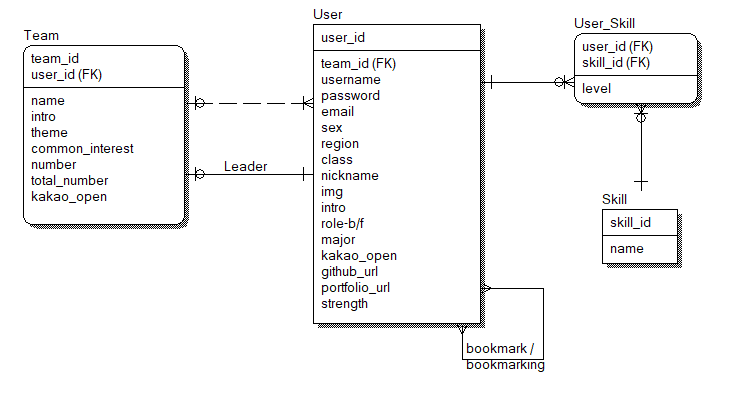
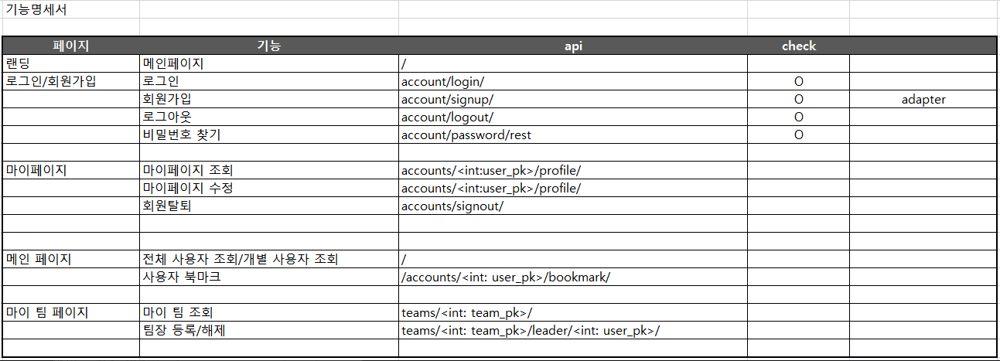

# 프로젝트 팀을 찾는 사이트(가제)

### 🤝팀원

| 이름   | 담당 영역 | Github                        |
| ------ | --------- | ----------------------------- |
| 박시원 |           | https://github.com/siwon-park |
| 이현정 |           | https://github.com/lhynjn9    |

### 📝Description

- 프로젝트 팀을 찾기 위한 개발자 정보 제공 프로젝트
- 나의 개발 능력을 나타내고 팀의 역량을 드러내어 쌍방으로 소통할 수 있는 사이트
- 기획의도 : 본인의 개발 역량 정보를 제공하고 다른 사람들의 개발 역량 정보를 확인하여 프로젝트 팀 구성에 도움을 주기 위한 프로젝트

### 🥇GOAL

- 사용자가 등록한 개발 역량 표시
- 팀 구성을 위한 이메일/메시지/DM 기능
- HTML, CSS, JavaScript, Bootstrap, Vue.js, REST API, Database 등을 활용한 실제 서비스 설계
- SSAFY 7기 배포
  - 피드백 점검
  - 서비스 관리 및 유지 보수

### 🎨 서비스 구현

| No   | 기능                           | 기능 설명                                                    | 추가 기능                  |
| ---- | ------------------------------ | ------------------------------------------------------------ | -------------------------- |
| 1    | 로그인                         |                                                              | Oauth를 이용한 소셜 로그인 |
| 2    | 로그아웃                       |                                                              |                            |
| 3    | 회원가입                       |                                                              |                            |
| 4    | 회원탈퇴                       |                                                              |                            |
| 5    | 마이페이지                     | 1. 2인 이상만 팀 등록 가능 2. 회원 정보 수정 3. 선택적으로 나의 개발 능력 오픈 설정  |                            |
| 6    | 개발 동료 찾기(메인/팀 페이지) | 1. 관심 설정 2. 연락방법 : DM기능/카카오 오픈챗/email 등 선택? 3. 팀 카드와 개인 카드를 크기로/백엔드와 프론트엔드를 색으로 구분 4. 카드를 뒤집으면 정보 확인(세부 열람) 5. 전체 카드 뒤집어보기 기능(전체 열람) 6. 필터링, 정렬 기능 |                            |
| 7    | 팀 페이지                      | 1. 나의 팀 페이지 2. 처음에는 팀장만 권한 수정 3. 이후 팀장의 권한 설정에 따라 팀원들도 수정 가능 |                            |

### 🛠Tech Stack

### 🏗데이터베이스 모델링(ERD)

### 🐾 기능 명세서

### 🏔컴포넌트 구조

### 🎮 서비스 플로우 차트

### 📜 개발일지

| No.  | Date     | Content                  | FollowUP                     |
| ---- | -------- | ------------------------ | ---------------------------- |
| 1    | 22/06/06 | 서비스 기능 구체화       | ERD 설계                     |
| 2    | 22/06/07 | ERD 설계                 | 모델 작성                    |
| 3    | 22/06/08 | 모델 작성                | seializer 작성, adapter 작성 |
| 4    | 22/06/09 | serializer, adapter 작성 | views 컴포넌트 및 기능 구현  |
|      |          |                          |                              |
|      |          |                          |                              |

### 💎배웠던 점

| NO.  | Content                                |
| ---- | -------------------------------------- |
| 1    | - OneToOneField : 1:1 외래키 관계 설정 |

### 🔥이슈 관리

| No.  | Name | Content | Solve | follow-up |
| ---- | ---- | ------- | ----- | --------- |
| 1    |      |         |       |           |
|      |      |         |       |           |
|      |      |         |       |           |
|      |      |         |       |           |
|      |      |         |       |           |

### 🤔 느낀점

